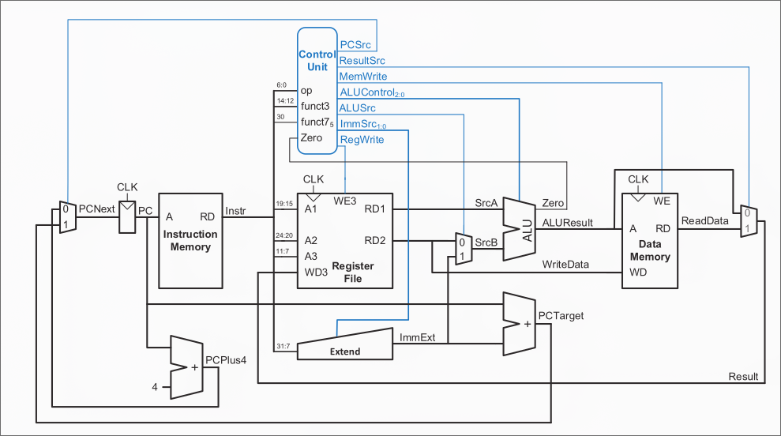

# RISCV32_PROC

## Introduction
- Utilized the RV32-I ISA, to ensure compatibility with standard RISC-V instructions.
- Developed the processor architecture to handle fetch, decode, execute, memory access, and write-back stages within a single clock cycle.
## Block Diagram

